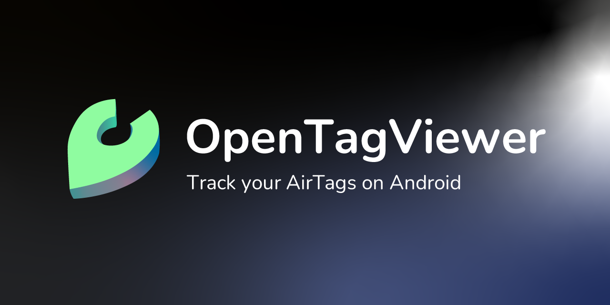
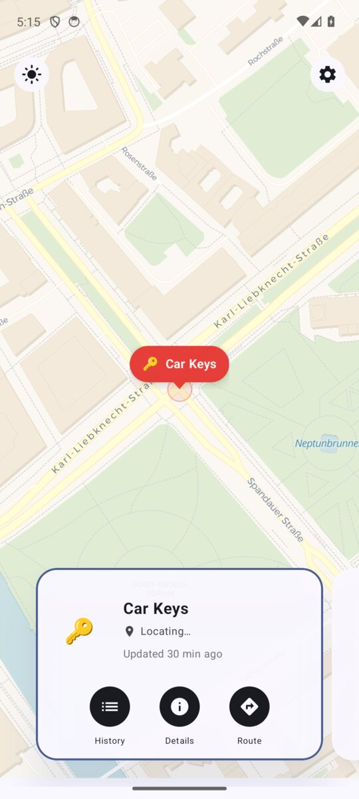
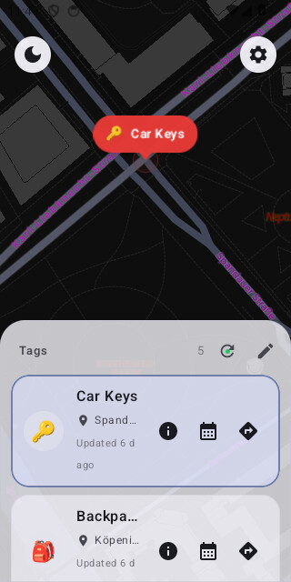
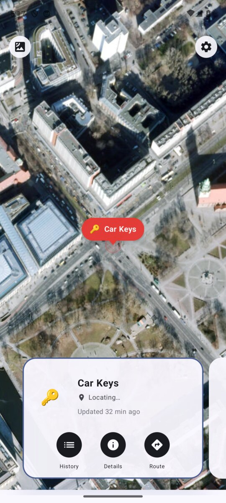

<h1>
    TagHistory
</h1>

**TagHistory** is an Android app for viewing live and historical locations of your Apple AirTags.
It is a Kotlin Multiplatform + Compose rewrite of [OpenTagViewer](https://github.com/parawanderer/OpenTagViewer),
built on the [FindMy.py](https://github.com/malmeloo/FindMy.py) library.

> [!WARNING]
> This project is not affiliated with Apple Inc. or Google LLC in any capacity.

|☀️ Light Mode|🌑 Dark Mode|🛰️ Satellite|
|----|----|----|
||||

## Features ⭐

* **Live map**: all your AirTags on a map, refreshed every 60 seconds.
* **Tag cards**: swipe through tags at the bottom; cards and map markers stay in sync.
* **Location history timeline**: scrub through a tag's full position history day by day, Google Maps Timeline style.
* **Background sync**: configurable automatic refresh interval.
* **Light, Dark, Satellite** basemap toggle.
* **Rename and emoji**: give each tag a custom name and emoji.
* **Route**: tap Route on any card to open your preferred navigation app.

## Requirements 🤓

1. An Android phone running Android 7.0+ (API 24)
2. A free [Apple Account](https://account.apple.com/) with 2FA via SMS or Trusted Device
3. One or more AirTags registered to your Apple account via the FindMy app
4. A Mac or macOS VM (needed once to export your AirTag data, see below)

## How To Use 📖

1. **Install** the APK from the [latest release](https://github.com/tieo/TagHistory/releases/latest).
2. **Log in** with your Apple ID inside the app.
3. **Export** your AirTag data on a Mac using the [OpenTagViewer macOS Exporter](https://github.com/parawanderer/OpenTagViewer/wiki/How-To:-Export-AirTags-From-Mac). This produces a `.zip` file.
4. **Import** the `.zip` in the app.
5. Your AirTags now appear on the map and update automatically.

See the [upstream wiki](https://github.com/parawanderer/OpenTagViewer/wiki) for detailed setup instructions. The export and login process is unchanged from OpenTagViewer.

## Contributing

PRs are welcome. Things that would be great to have, with up-to-date status as of 2026-05:

* `🟢 Doable` Nearby AirTag detection via Bluetooth. FindMy.py's key-rotation derivation was fixed in late 2025 ([issue #90](https://github.com/malmeloo/FindMy.py/issues/90)); the crypto path (HKDF + P-224) is a few hundred lines to port to pure Kotlin.
* `🟢 Doable` "Ring" / Make Noise button. The BLE play-sound characteristic write is fully understood; an experimental ref impl landed in [FindMy.py PR #211](https://github.com/malmeloo/FindMy.py/pull/211) and [AirGuard](https://github.com/seemoo-lab/AirGuard) does it in production. Mostly Android BLE permissioning + GATT write.
* `🟡 Medium` Support for [OpenHaystack](https://github.com/seemoo-lab/openhaystack) tags. Same P-224 ECIES decrypt path as AirTags, additional import flow for OH keys plus a [macless-haystack](https://github.com/dchristl/macless-haystack)-style relay endpoint.
* `🟠 Larger` Integrate Google Find My Device. Protocol publicly RE'd in 2025 ([GoogleFindMyTools](https://github.com/leonboe1/GoogleFindMyTools), Python). Mostly auth + gRPC port.
* `🟠 Larger` Integrate Samsung SmartTag. [uTag](https://github.com/KieronQuinn/uTag) already has the Kotlin network/crypto modules; adapting them into a library subproject is the lightest path.
* `🟢 Easy` Additional language translations. Add a new `strings.xml` under `composeApp/src/commonMain/composeResources/values-<locale>/`. English baseline and German live there already.

## Credits

* [OpenTagViewer](https://github.com/parawanderer/OpenTagViewer) by Shane B. The original Java app this is based on.
* [FindMy.py](https://github.com/malmeloo/FindMy.py) by malmeloo. The FindMy network library.
* [Material Icons](https://fonts.google.com/icons) by Google.
* [MapLibre Android](https://github.com/maplibre/maplibre-gl-native) for map rendering.

## License: MIT
